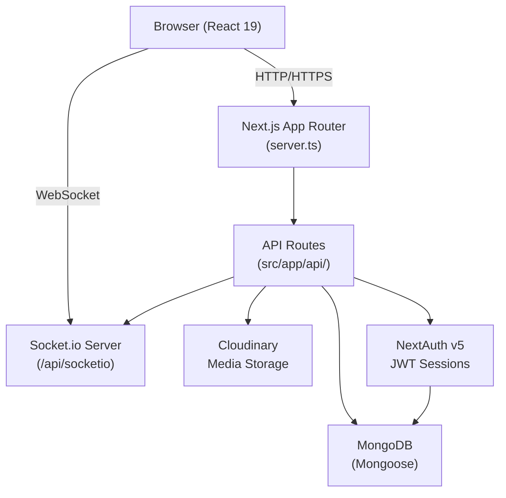

# Design Document — LMS Core

## Overview

The LMS Core is a full-stack Learning Management System built on the Next.js 16 App Router. It supports three roles — **admin**, **instructor**, and **student** — each with a distinct set of capabilities. The system is designed as a monorepo Next.js application with a custom Node.js HTTP server that co-hosts the Socket.io real-time layer alongside the Next.js request handler.

### Technology Stack

| Concern        | Choice                                           |
| -------------- | ------------------------------------------------ |
| Framework      | Next.js 16 App Router (React 19, TypeScript)     |
| Database       | MongoDB via Mongoose 9                           |
| Authentication | NextAuth v5 (Credentials provider, JWT strategy) |
| Media Storage  | Cloudinary (signed direct-upload)                |
| Real-time      | Socket.io 4 (custom `server.ts` entry point)     |
| Styling        | Tailwind CSS v4 + shadcn/ui                      |
| Validation     | Zod v4                                           |
| Forms          | React Hook Form + `@hookform/resolvers`          |
| State          | Zustand (client), TanStack Query (server state)  |
| Email          | Resend                                           |

### Key Architectural Decisions

1. **Custom server entry point (`server.ts`)** — Next.js does not natively support WebSockets. A thin Node.js HTTP server wraps the Next.js request handler and attaches a Socket.io server on the same port at path `/api/socketio`. The `io` instance is stored in a module-level singleton (`src/lib/socket.ts`) so any API route can emit events without importing the server directly.

2. **Edge-safe auth split** — NextAuth v5 requires an edge-compatible config for the middleware. `auth.config.ts` contains only the JWT/session callbacks and is imported by `middleware.ts`. The full `auth.ts` (with the Credentials provider and bcrypt) runs only in Node.js API routes.

3. **Embedded documents for course structure** — Modules and content items are embedded inside the `Course` document rather than stored as separate collections. This keeps course reads as a single query and avoids join overhead for the most common access pattern (loading a course with all its content).

4. **Signed Cloudinary direct-upload** — Large files (video, PDF) are never proxied through the application server. The Upload API generates a signed parameter set; the client uploads directly to Cloudinary. This keeps the Next.js server stateless with respect to file I/O.

5. **React Compiler enabled** — `next.config.ts` enables the React Compiler (`reactCompiler: true`), which automatically memoizes components and hooks. Manual `useMemo`/`useCallback` should be avoided unless the compiler cannot infer the optimization.

---

## Architecture

### System Layers



### Request Lifecycle

1. **Middleware** (`middleware.ts`) runs on the Edge runtime. It calls `auth()` from `auth.config.ts` to check for a valid JWT. Unauthenticated requests to protected routes are redirected to `/login`.
2. **Server Components** (page files) call `auth()` from `auth.ts` to read the session and pass it as props or use it for server-side data fetching.
3. **API Routes** call `auth()`, check the session role, parse the request body with a Zod schema, execute the database operation, optionally emit a Socket.io event, and return a JSON response.
4. **Client Components** use TanStack Query for data fetching and Zustand for ephemeral UI state. Socket.io events are consumed via the `useSocket` hook.

### Route Groups

```
src/app/
├── (app)/                  # Authenticated shell (layout with sidebar/nav)
│   ├── dashboard/          # Role-aware dashboard
│   ├── courses/            # Student course browsing and learning
│   ├── instructor/         # Instructor course management, grades
│   ├── admin/              # Admin user management, overview
│   └── notifications/      # Notification inbox
├── login/                  # Public login page
└── api/                    # API route handlers
```

### Role-Based Access Control

| Route Prefix                   | Allowed Roles                             |
| ------------------------------ | ----------------------------------------- |
| `/admin/*`                     | admin                                     |
| `/instructor/*`                | instructor, admin                         |
| `/courses/*`                   | student, admin                            |
| `/dashboard`                   | all authenticated                         |
| `/api/users`                   | admin                                     |
| `/api/courses` (write)         | instructor, admin                         |
| `/api/courses` (read)          | all authenticated                         |
| `/api/assessments` (write)     | instructor, admin                         |
| `/api/assessments/[id]/submit` | student                                   |
| `/api/grades` (write)          | instructor, admin                         |
| `/api/grades` (read)           | student (own), instructor (owned courses) |
| `/api/progress`                | student (own)                             |
| `/api/upload`                  | instructor, student                       |
| `/api/notifications`           | owner only                                |
| `/api/announcements` (write)   | instructor, admin                         |
| `/api/announcements` (read)    | all authenticated                         |

---

## Components and Interfaces

### API Route Conventions

Every API route follows this pattern:

```typescript
// 1. Authenticate
const session = await auth();
if (!session)
  return NextResponse.json({ error: "Unauthorized" }, { status: 401 });

// 2. Authorize (role check)
if (session.user.role !== "admin")
  return NextResponse.json({ error: "Forbidden" }, { status: 403 });

// 3. Validate input
const parsed = SomeZodSchema.safeParse(await req.json());
if (!parsed.success)
  return NextResponse.json(
    { error: "Validation error", details: parsed.error.flatten() },
    { status: 400 },
  );

// 4. Database operation
await connectDB();
// ...

// 5. Optionally emit Socket.io event
emitNotification(userId, { message: "...", type: "..." });

// 6. Return structured response
return NextResponse.json({ data: result });
```

Error responses always use the shape `{ error: string, details?: unknown }`.

### Zod Schemas (src/lib/schemas/)

Each domain has a dedicated schema file:

- `userSchemas.ts` — `createUserSchema`, `updateUserSchema`, `assignCoursesSchema`
- `courseSchemas.ts` — `createCourseSchema`, `updateCourseSchema`, `addModuleSchema`, `addContentSchema`
- `assessmentSchemas.ts` — `createAssessmentSchema`, `addQuestionSchema`, `submitQuizSchema`, `submitAssignmentSchema`
- `gradeSchemas.ts` — `gradeAssignmentSchema`
- `progressSchemas.ts` — `updateProgressSchema`
- `notificationSchemas.ts` — `markReadSchema`
- `announcementSchemas.ts` — `createAnnouncementSchema`
- `uploadSchemas.ts` — `uploadRequestSchema`

### Client Components

#### `src/components/learn/`

| Component         | Responsibility                                                                          |
| ----------------- | --------------------------------------------------------------------------------------- |
| `VideoPlayer`     | Renders Cloudinary/YouTube video; reports watch progress via `useProgress` hook         |
| `ContentViewer`   | Dispatches to `VideoPlayer`, PDF embed, link redirect, or YouTube embed based on `type` |
| `CourseSidebar`   | Renders module/content tree with lock/unlock state; highlights current item             |
| `AssessmentTaker` | Renders quiz/test questions; manages countdown timer for tests; submits answers         |

#### `src/components/instructor/`

| Component           | Responsibility                                                                  |
| ------------------- | ------------------------------------------------------------------------------- |
| `CourseForm`        | Create/edit course metadata with React Hook Form + Zod                          |
| `ModuleBuilder`     | Add/reorder/delete modules and content items via drag-and-drop                  |
| `VideoUploader`     | Requests signed upload URL, uploads directly to Cloudinary, stores returned URL |
| `AssessmentBuilder` | Build quiz/test/assignment with question editor                                 |
| `GradeBook`         | Tabular view of all student results; inline grade input for assignments         |
| `AssignUsers`       | Multi-select student assignment UI                                              |
| `AnnouncementForm`  | Create announcement with optional course scope                                  |

#### `src/components/admin/`

| Component   | Responsibility                                                             |
| ----------- | -------------------------------------------------------------------------- |
| `UserTable` | Paginated user list with role badge, activate/deactivate, and edit actions |

### Custom Hooks

| Hook               | Location                                 | Purpose                                                        |
| ------------------ | ---------------------------------------- | -------------------------------------------------------------- |
| `useAuth`          | `src/lib/useAuth.ts`                     | Reads session from NextAuth client                             |
| `useSocket`        | `src/lib/useSocket.ts`                   | Connects to Socket.io, joins user room, exposes event listener |
| `useNotifications` | `src/lib/useNotifications.ts`            | Fetches notification list; merges real-time events             |
| `useProgress`      | (to be created) `src/lib/useProgress.ts` | Debounced progress reporting for video watch time              |

---

## Data Models

All models live in `src/models/`. Mongoose is used with TypeScript interfaces.

### User

```typescript
interface IUser {
  name: string;
  email: string; // unique, lowercase
  passwordHash: string; // bcrypt — NEVER returned in API responses
  role: "admin" | "instructor" | "student";
  assignedCourses: ObjectId[]; // course IDs (students only, populated by admin)
  isActive: boolean;
  createdAt: Date;
  updatedAt: Date;
}
```

Index: `email` (unique).

### Course

```typescript
interface ICourse {
  title: string;
  description: string;
  thumbnail?: string; // Cloudinary URL
  category: string;
  createdBy: ObjectId; // ref: User (instructor)
  modules: IModule[]; // embedded, ordered by `order`
  status: "draft" | "published";
  createdAt: Date;
  updatedAt: Date;
}

interface IModule {
  _id: ObjectId;
  title: string;
  order: number;
  videos: IContentItem[]; // embedded, ordered by `order`
  assessmentId?: ObjectId; // ref: Assessment
}

interface IContentItem {
  _id: ObjectId;
  title: string;
  order: number;
  url: string;
  publicId?: string; // Cloudinary public_id (video/pdf only)
  type: "video" | "youtube" | "link" | "pdf";
  duration: number; // seconds (video/youtube); 0 for others
  description?: string;
  thumbnailUrl?: string;
}
```

### Assessment

```typescript
interface IAssessment {
  moduleId: ObjectId;
  courseId: ObjectId;
  title: string;
  type: "quiz" | "test" | "assignment";
  questions: IQuestion[]; // empty for assignments
  passingScore: number; // 0–100
  timeLimit?: number; // minutes; only for type === "test"
  instructions?: string; // only for type === "assignment"
  createdAt: Date;
  updatedAt: Date;
}

interface IQuestion {
  _id: ObjectId;
  type: "mcq" | "truefalse";
  text: string;
  options?: string[]; // MCQ choices
  correctAnswer?: string; // hidden from student API responses
}
```

### AssessmentResult

```typescript
interface IAssessmentResult {
  userId: ObjectId;
  assessmentId: ObjectId;
  courseId: ObjectId;
  type: "quiz" | "test" | "assignment"; // denormalized for filtering
  attemptNumber: number; // 1-based; incremented on retry
  answers: IAnswer[]; // quiz/test answers
  submissionText?: string; // assignment text response
  fileUrl?: string; // assignment file (Cloudinary URL)
  score: number; // percentage 0–100
  passed: boolean;
  feedback?: string; // instructor feedback (assignments)
  gradedBy?: ObjectId; // ref: User (instructor)
  gradedAt?: Date;
  createdAt: Date;
  updatedAt: Date;
}

interface IAnswer {
  questionId: ObjectId;
  answer: string;
  isCorrect?: boolean;
}
```

Index: `{ userId, assessmentId }` for fast attempt lookup.

### UserProgress

```typescript
interface IUserProgress {
  userId: ObjectId;
  courseId: ObjectId;
  videoId: ObjectId; // content item _id
  watchedSeconds: number;
  totalSeconds: number;
  completed: boolean; // true when watchedSeconds / totalSeconds >= 0.75
  lastUpdated: Date;
}
```

Index: `{ userId, videoId }` (unique).

### Notification

```typescript
interface INotification {
  userId: ObjectId;
  type: "announcement" | "unlock" | "grade" | "system";
  message: string;
  link?: string;
  read: boolean;
  createdAt: Date;
}
```

Index: `{ userId, createdAt: -1 }` for efficient inbox queries.

### Announcement

```typescript
interface IAnnouncement {
  title: string;
  body: string;
  courseId?: ObjectId; // null = platform-wide
  createdBy: ObjectId;
  createdAt: Date;
}
```

Index: `{ courseId: 1, createdAt: -1 }`.

### Model Integrity Rules

- `User.email` — unique index, stored lowercase.
- `UserProgress` — unique compound index `{ userId, videoId }`.
- `Assessment.timeLimit` — only stored when `type === "test"`.
- `Assessment.instructions` — only stored when `type === "assignment"`.
- `Assessment.questions` — only populated for `quiz` and `test`.
- `AssessmentResult.attemptNumber` — starts at 1, incremented on each new attempt.
- `AssessmentResult.type` — denormalized from the Assessment to allow type-specific filtering without a join.
- `passwordHash` — excluded from all API responses via Mongoose `select: false` or explicit projection.

---

## Correctness Properties

_A property is a characteristic or behavior that should hold true across all valid executions of a system — essentially, a formal statement about what the system should do. Properties serve as the bridge between human-readable specifications and machine-verifiable correctness guarantees._

### Property 1: Score calculation correctness

_For any_ quiz or test submission with N questions and K correct answers, the computed score SHALL equal `(K / N) * 100`, and `passed` SHALL be `true` if and only if `score >= passingScore`.

**Validates: Requirements 12.1, 12.3, 12.4**

---

### Property 2: Password hash never leaks

_For any_ API response from any endpoint in the system, the response body SHALL NOT contain a field named `passwordHash` or any value equal to a stored bcrypt hash.

**Validates: Requirements 1.5, 2.7, 17.4**

---

### Property 3: Content unlock sequencing

_For any_ course with an ordered list of content items, a content item at position N SHALL be unlocked for a student if and only if the content item at position N-1 has `completed: true` in that student's `UserProgress` records (or N === 0, i.e., it is the first item).

**Validates: Requirements 11.1, 11.2**

---

### Property 4: Video completion threshold

_For any_ video content item with `totalSeconds > 0`, the `UserProgress` record SHALL have `completed: true` if and only if `watchedSeconds / totalSeconds >= 0.75`.

**Validates: Requirements 11.3**

---

### Property 5: Attempt number monotonicity

_For any_ student and assessment, the `attemptNumber` on each successive `AssessmentResult` record SHALL be strictly greater than the `attemptNumber` of all prior records for the same `(userId, assessmentId)` pair.

**Validates: Requirements 12.6, 13.4, 19.4**

---

### Property 6: Passing attempt blocks re-submission

_For any_ student who has an `AssessmentResult` with `passed: true` for a given assessment, any subsequent submission attempt for that same assessment SHALL be rejected with a 403 error.

**Validates: Requirements 12.5, 13.3**

---

### Property 7: Role-based access enforcement

_For any_ API request to a role-restricted endpoint, the response status SHALL be 403 if the session role is insufficient, 401 if there is no session, and 2xx only when the role is authorized.

**Validates: Requirements 17.1, 17.2, 17.5, 17.6**

---

### Property 8: Zod validation rejects malformed input

_For any_ API route that accepts a request body, submitting a body that fails the route's Zod schema SHALL return a 400 response with `{ error: string, details: ... }` and SHALL NOT execute any database write.

**Validates: Requirements 2.3, 3.3, 5.4, 6.8, 7.5, 8.2, 11.6, 12.7, 13.5, 15.6, 16.4, 17.3, 18.4**

---

### Property 9: Student course visibility

_For any_ student, the course list endpoint SHALL return only courses where the course ID is in the student's `assignedCourses` array AND the course `status` is `"published"`.

**Validates: Requirements 10.1**

---

### Property 10: Notification delivery consistency

_For any_ event that triggers a notification (content unlock, grade saved, announcement), a `Notification` document SHALL be persisted to the database AND a Socket.io event SHALL be emitted to `user:{userId}` before the triggering API response is returned.

**Validates: Requirements 8.4, 11.5, 15.1, 15.2, 16.2, 16.3**

---

### Property 11: Cloudinary asset cleanup on content deletion

_For any_ content item with a non-null `publicId`, deleting that content item via the Content API SHALL result in a Cloudinary deletion call for that `publicId` before the API response is returned.

**Validates: Requirements 6.7**

---

### Property 12: Assignment submission round-trip

_For any_ valid assignment submission (text and/or file URL), the stored `AssessmentResult` SHALL contain the exact `submissionText` and `fileUrl` values that were submitted, with `passed: false` and no `gradedAt` until manually graded.

**Validates: Requirements 13.1**

---

### Property 13: Course assignment idempotence

_For any_ student and course ID, calling the assign endpoint multiple times with the same course ID SHALL result in the course ID appearing exactly once in the student's `assignedCourses` array — the operation is idempotent.

**Validates: Requirements 3.5**

---

## Error Handling

### HTTP Status Code Conventions

| Condition                            | Status |
| ------------------------------------ | ------ |
| No session / invalid JWT             | 401    |
| Valid session, insufficient role     | 403    |
| Resource not found                   | 404    |
| Duplicate unique field (e.g., email) | 409    |
| Zod validation failure               | 400    |
| Successful read                      | 200    |
| Successful create                    | 201    |
| Successful update/delete             | 200    |

### Error Response Shape

All error responses use:

```json
{
  "error": "Human-readable message",
  "details": "<optional Zod flatten output or extra context>"
}
```

### Authentication Errors

- Login failures (wrong email, wrong password, inactive account) all return the same generic message: `"Invalid credentials"`. The specific reason is logged server-side but never exposed to the client (prevents user enumeration).

### Database Errors

- Mongoose `ValidationError` → 400 with field-level details.
- Mongoose duplicate key error (code 11000) → 409 with a descriptive message.
- Unexpected errors → 500 with a generic message; full error logged server-side.

### Cloudinary Errors

- If a Cloudinary deletion call fails during content item deletion, the error is logged but does not block the database deletion. The content item is removed from the course document regardless.
- If signed upload parameter generation fails, the Upload API returns 500.

### Socket.io Errors

- `emitNotification` is a best-effort call. If the Socket.io server is not running (e.g., during tests), `getIO()` returns `null` and the emit is silently skipped. The database notification record is always written first.

### Assessment Submission Edge Cases

- Submitting a test after `timeLimit` has expired: the server validates the submission timestamp against `createdAt` of the assessment result attempt. If expired, returns 403.
- Submitting answers for questions that do not belong to the assessment: Zod schema validates `questionId` membership; invalid IDs return 400.

---

## Testing Strategy

### Dual Testing Approach

The project uses both **unit/example-based tests** and **property-based tests** for comprehensive coverage.

- **Unit tests** cover specific examples, integration points, and error conditions.
- **Property-based tests** verify universal invariants across a wide range of generated inputs.

### Test Framework

- **Test runner**: [Vitest](https://vitest.dev/) — compatible with the TypeScript/ESM setup and fast in CI.
- **Property-based testing library**: [fast-check](https://fast-check.io/) — mature TypeScript-first PBT library.
- **Mocking**: Vitest's built-in `vi.mock` for Mongoose models and Cloudinary SDK.
- **Minimum iterations per property test**: 100 (fast-check default).

### Property Test Tags

Each property test is tagged with a comment in the format:

```
// Feature: lms-core, Property N: <property_text>
```

### Unit Test Coverage Targets

| Domain           | Test Type          | Focus                                                      |
| ---------------- | ------------------ | ---------------------------------------------------------- |
| Auth             | Example            | Valid login, wrong password, inactive user, missing fields |
| User API         | Example + Property | CRUD, role enforcement, password hash exclusion            |
| Course API       | Example            | Create, update, delete, ownership check                    |
| Assessment API   | Example            | Create quiz/test/assignment, question add/remove           |
| Submission API   | Property           | Score calculation, pass/fail, attempt numbering            |
| Progress API     | Property           | Completion threshold, unlock sequencing                    |
| Grades API       | Example            | Manual grade save, 403 on wrong course                     |
| Notification API | Example            | Persist + emit, mark read, ownership                       |
| Upload API       | Example            | Signed params returned, 401 on unauthenticated             |
| Zod Schemas      | Property           | Reject invalid inputs across all schemas                   |

### Property Test Implementations

Each correctness property maps to a single `fc.assert(fc.property(...))` test:

**Property 1 — Score calculation:**
Generate random arrays of `{isCorrect: boolean}` answers and a `passingScore`. Verify the computed score and `passed` flag match the formula.

**Property 3 — Content unlock sequencing:**
Generate random course structures (modules with ordered content items) and random `UserProgress` states. Verify the unlock predicate matches the sequential rule.

**Property 4 — Video completion threshold:**
Generate random `(watchedSeconds, totalSeconds)` pairs. Verify `completed` equals `watchedSeconds / totalSeconds >= 0.75`.

**Property 5 — Attempt number monotonicity:**
Generate sequences of submission events for the same `(userId, assessmentId)`. Verify each new `AssessmentResult` has `attemptNumber` strictly greater than all prior ones.

**Property 6 — Passing attempt blocks re-submission:**
Generate a prior result with `passed: true`. Verify the submission handler returns 403 for any subsequent attempt.

**Property 7 — Role-based access:**
Generate random `(role, endpoint)` pairs. Verify the authorization check returns the correct status code.

**Property 8 — Zod validation:**
Use fast-check's `fc.anything()` to generate arbitrary objects. Verify that objects not matching the schema always return 400 and never reach the database layer.

**Property 9 — Student course visibility:**
Generate random student `assignedCourses` arrays and course catalogs with mixed statuses. Verify the filtered result contains only published courses in the student's list.

**Property 12 — Assignment round-trip:**
Generate random `submissionText` strings and `fileUrl` values. Verify the stored `AssessmentResult` fields match exactly.

**Property 13 — Course assignment idempotence:**
Generate random `(studentId, courseId)` pairs. Call the assign endpoint 2–5 times with the same pair. Verify the course ID appears exactly once in `assignedCourses`.

### Integration Tests

- End-to-end API route tests using a real MongoDB test database (via `mongodb-memory-server`).
- Socket.io emit verification using a test Socket.io client.
- Cloudinary calls mocked in all non-integration tests.

### UI Tests

- Snapshot tests for key page components (dashboard, course detail, assessment taker).
- React Testing Library for interaction tests (form submission, timer countdown).
